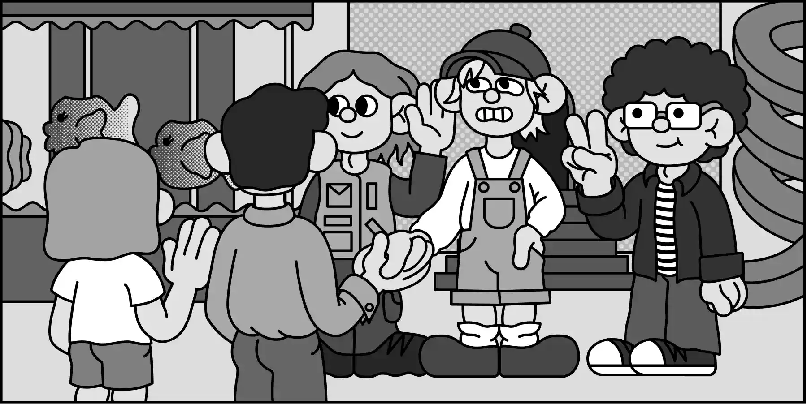

# :house: Welcome to Domik Ltd.
> Your choice is our concern. We'll help you to make the right decision! 

_"Domik Ltd."_ is an short illustrated web story filled with puzzles and mini-games. The book is set in a fictional world and follows the story of a 
character who has been recently confused about his life choices. 

It's a fun side-project that I made to practice in story-telling, character design and programming of small interactive elements embedded in the text.

You'll need an **access code** to read the story, you can find the codes for each released chapter [here](https://t.me/domik_ltd).

*:gb: The book is yet to be translated to English, in the meantime, you can play around with the puzzles and check out the source code. Good luck!*

